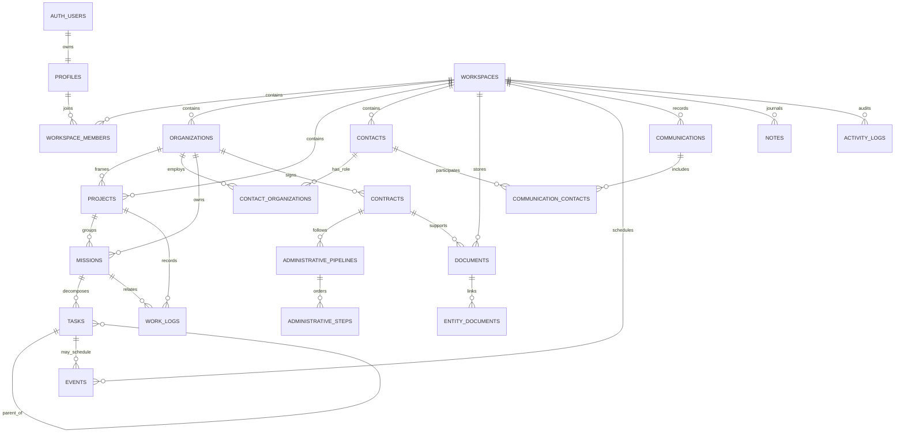

# PROFESSIONAL HUB — OPEN SOURCE REUSE REPORT

**Statut :** dossier de conception — aucune implémentation applicative  
**Date de référence :** 31 août 2026  
**Périmètre :** Professional Hub personnel, responsive, centré sur les activités Soufflet Malt, CROUS, formation et administration  
**Méthode :** inspection des dépôts, licences, arborescences, modèles et documentation primaire; les avis de licence restent à faire valider par un juriste avant redistribution.

## 1. Executive Summary

Professional Hub doit être un **modular monolith** Next.js adossé à Supabase, pas un assemblage de CRM, GED, gestionnaire de projets et ERP auto-hébergés. La frontière produit est un espace personnel privé; les organisations sont des contextes, non des tenants techniques séparés.

Décisions recommandées :

1. **Réutiliser directement Supabase (A)** pour PostgreSQL, Auth, Storage privé et RLS. Le dépôt et les exemples officiels sont sous Apache-2.0; les règles de sécurité doivent être écrites par Professional Hub, pas héritées d'un exemple. Sources : [dépôt Supabase](https://github.com/supabase/supabase), [exemple officiel Next.js user management](https://github.com/supabase/supabase/tree/master/examples/user-management/nextjs-user-management), [sécurisation de la base](https://supabase.com/docs/guides/database/secure-data), [contrôle d'accès Storage](https://supabase.com/docs/guides/storage/security/access-control).
2. **Réutiliser directement FullCalendar (A)** via ses paquets MIT pour les vues mois/semaine/jour et les interactions. Conserver le modèle `events` et le calcul de conflits dans notre domaine afin de pouvoir remplacer le composant. Sources : [dépôt](https://github.com/fullcalendar/fullcalendar), [licence MIT](https://github.com/fullcalendar/fullcalendar/blob/main/LICENSE.txt), [intégration React](https://fullcalendar.io/docs/react), [règles de chevauchement](https://fullcalendar.io/docs/eventOverlap).
3. **Utiliser n8n comme service externe en phase 2 (A-service)**, jamais comme dépendance du cœur ni comme code embarqué. Sa licence « Sustainable Use » est fair-code et non une licence open source OSI classique; sa base de données ne devient pas la source de vérité. Sources : [dépôt et conditions de licence](https://github.com/n8n-io/n8n), [licence](https://github.com/n8n-io/n8n/blob/master/LICENSE.md).
4. **Adapter l'AI SDK de Vercel en phase 3 (B)** pour des sorties structurées et des outils serveur avec approbation humaine. Aucun outil de mutation libre, SQL arbitraire ou envoi automatique. Sources : [dépôt](https://github.com/vercel/ai), [licence Apache-2.0](https://github.com/vercel/ai/blob/main/LICENSE), [documentation](https://ai-sdk.dev/docs/introduction).
5. **Étudier les patrons uniquement (C)** dans Twenty, Plane, Papra, Paperless-ngx, Kimai, Documenso et Cal.diy. Leurs modèles sont utiles, mais les copier importerait des licences copyleft, des dépendances lourdes ou des domaines trop complexes.
6. **Ne pas reprendre les applications complètes (D)**. Sont notamment rejetés du MVP : CRM configurable, cycles/sprints, OCR, classification automatique, facturation, signature électronique, moteur de workflows, synchronisation bidirectionnelle et assistants autonomes.

Le MVP doit rester manuel et fiable : dashboard agrégé, organisations, contacts, missions/tâches, documents privés, calendrier interne, suivi administratif, journal et heures CROUS. La preuve de valeur est la réduction du temps nécessaire pour décider quoi faire et retrouver l'information, pas le nombre d'intégrations.

## 2. Repository Analysis

### 2.1 Supabase

- **URL :** [github.com/supabase/supabase](https://github.com/supabase/supabase)
- **LICENSE :** Apache-2.0 pour le monorepo inspecté; vérifier séparément toute brique auto-hébergée additionnelle. [Licence](https://github.com/supabase/supabase/blob/master/LICENSE)
- **TECH STACK :** TypeScript, Next.js/React pour les surfaces web, PostgreSQL, Go/Rust/Elixir selon les services de la plateforme.
- **ACTIVITY / MAINTENANCE :** très active, commits et publications fréquents; risque principal : évolution rapide des APIs et de la CLI.
- **RELEVANT MODULE :** Auth, PostgreSQL/RLS, Storage, migrations, client SSR Next.js.
- **FILES / DIRECTORIES TO INSPECT :** `examples/user-management/nextjs-user-management/`, `apps/`, `packages/`, `supabase/`, documentation Auth/Database/Storage.
- **INTERESTING ARCHITECTURE :** identité gérée hors tables métier, session côté serveur, règles RLS au plus près des données, Storage contrôlé par les mêmes identités.
- **DATA MODEL :** `auth.users` est la racine d'identité; les profils et appartenances applicatives restent dans le schéma public. Les objets Storage ont des politiques propres.
- **UX PATTERNS :** onboarding/authentification sobre, magic link ou mot de passe, états session/chargement explicites.
- **REUSABLE COMPONENTS :** client Supabase SSR, helpers d'authentification et exemple de profil; aucun copier-coller aveugle de UI.
- **REUSABLE LOGIC :** migrations, sessions SSR, upload privé, URL signée courte, politiques `auth.uid()`.
- **WHAT NOT TO COPY :** dashboard Supabase, architecture multi-produit, exemples sans adaptation de RLS, clé `service_role` dans le navigateur.
- **DEPENDENCY RISK :** moyen : dépendance de plateforme et changements de SDK; atténuée par des adapters et des migrations SQL versionnées.
- **LICENSE RISK :** faible pour le code Apache-2.0 inspecté; les services annexes ont leurs propres conditions.
- **REUSE STRATEGY :** **A — réutilisation directe** comme infrastructure et SDK, avec modèle, migrations et politiques propriétaires.

### 2.2 Twenty

- **URL :** [github.com/twentyhq/twenty](https://github.com/twentyhq/twenty)
- **LICENSE :** noyau AGPL-3.0; plusieurs paquets sont explicitement MIT, dont `twenty-ui`, `twenty-shared` et les SDK. [Politique de licence](https://github.com/twentyhq/twenty/blob/main/LICENSE)
- **TECH STACK :** monorepo Nx, React, TypeScript, Jotai/Linaria/Lingui côté client; NestJS, PostgreSQL, Redis et BullMQ côté serveur. [Architecture racine](https://github.com/twentyhq/twenty)
- **ACTIVITY / MAINTENANCE :** très active et à fort churn; le volume de modules et de changements impose de pinner les versions.
- **RELEVANT MODULE :** contacts/companies, activités, notes et timeline CRM.
- **FILES / DIRECTORIES TO INSPECT :** `packages/twenty-front/src/modules/activities/`, `packages/twenty-front/src/modules/people/`, `packages/twenty-server/src/modules/`, `packages/twenty-ui/`, tests E2E.
- **INTERESTING ARCHITECTURE :** séparation objet/activité, timeline calculée depuis plusieurs types d'événements, modules front isolés du design system.
- **DATA MODEL :** personnes, entreprises, objets standards/configurables et relations morphiques; beaucoup plus dynamique que nécessaire ici.
- **UX PATTERNS :** fiche contact à panneaux, timeline chronologique, actions rapides, listes filtrables.
- **REUSABLE COMPONENTS :** composants de `twenty-ui` envisageables uniquement après audit paquet par paquet des licences, dépendances et coûts de thème.
- **REUSABLE LOGIC :** ordre chronologique, regroupement d'activités, calcul de dernière interaction et prochaine action.
- **WHAT NOT TO COPY :** moteur d'objets configurables, metadata engine, synchronisation messagerie/calendrier, backend NestJS et permissions multi-workspace.
- **DEPENDENCY RISK :** élevé : pile large, modèle dynamique et composants susceptibles d'être couplés à Linaria/Jotai.
- **LICENSE RISK :** élevé pour le noyau AGPL; faible à moyen pour un paquet MIT vérifié isolément.
- **REUSE STRATEGY :** **C — patrons seulement**; **B conditionnel** pour un composant `twenty-ui` isolé si l'audit de provenance est concluant.

### 2.3 Plane

- **URL :** [github.com/makeplane/plane](https://github.com/makeplane/plane)
- **LICENSE :** AGPL-3.0. [Licence](https://github.com/makeplane/plane/blob/preview/LICENSE)
- **TECH STACK :** React/TypeScript, Django/Python, PostgreSQL, Redis/Celery, monorepo `apps` et `packages`.
- **ACTIVITY / MAINTENANCE :** très active; nombreux changements et surface fonctionnelle vaste.
- **RELEVANT MODULE :** work items, sous-tâches, états, priorités, vues liste/Kanban.
- **FILES / DIRECTORIES TO INSPECT :** `apps/api/plane/db/models/`, `apps/api/plane/api/`, `apps/api/plane/tests/`, `apps/web/`, `packages/`.
- **INTERESTING ARCHITECTURE :** scoping workspace/project propagé aux modèles, sérialiseurs et endpoints; séparation nette domaine/API/background jobs.
- **DATA MODEL :** workspace, project, issue/work item, state, label, cycle, module, member. Le scoping est utile; cycles et membres ne le sont pas au MVP.
- **UX PATTERNS :** bascule liste/Kanban, filtres persistants, détail latéral, statut et priorité visibles.
- **REUSABLE COMPONENTS :** aucun composant copié; recréer une carte/tâche légère avec le design system retenu.
- **REUSABLE LOGIC :** profondeur de sous-tâche limitée, ordre de colonne explicite, filtres déterministes, transitions d'état.
- **WHAT NOT TO COPY :** cycles, sprints, modules, analytics, rôles d'équipe, importeurs et moteur de vues avancé.
- **DEPENDENCY RISK :** élevé : backend et front complets, Redis/Celery, conventions internes nombreuses.
- **LICENSE RISK :** élevé si code dérivé distribué, du fait de l'AGPL.
- **REUSE STRATEGY :** **C — patrons seulement**.

### 2.4 Papra

- **URL :** [github.com/papra-hq/papra](https://github.com/papra-hq/papra)
- **LICENSE :** AGPL-3.0. [Licence](https://github.com/papra-hq/papra/blob/main/LICENSE)
- **TECH STACK :** TypeScript monorepo, client et serveur distincts, Drizzle, API SDK, Vitest.
- **ACTIVITY / MAINTENANCE :** active, mais projet plus jeune que Paperless-ngx; modèle et APIs encore mouvants.
- **RELEVANT MODULE :** documents, partage, vues, propriétés, recherche et auto-tagging.
- **FILES / DIRECTORIES TO INSPECT :** `apps/papra-server/src/modules/documents/`, `document-views/`, `document-share-links/`, `custom-properties/`, `apps/papra-server/src/migrations/`, `packages/api-sdk/`, tests.
- **INTERESTING ARCHITECTURE :** modules serveur par capacité, migrations proches du serveur, SDK séparé et frontières document/partage/propriétés.
- **DATA MODEL :** documents rattachés à une organisation, métadonnées extensibles et liens de partage. Professional Hub doit supprimer le partage public du MVP.
- **UX PATTERNS :** bibliothèque, recherche, métadonnées visibles, vues sauvegardées.
- **REUSABLE COMPONENTS :** aucun composant direct sous AGPL; réimplémenter l'upload, la fiche et les filtres.
- **REUSABLE LOGIC :** états d'upload, empreinte de fichier, catégories/propriétés, recherche de métadonnées.
- **WHAT NOT TO COPY :** liens publics, IA/auto-tagging, propriétés arbitraires et arborescence de GED complète.
- **DEPENDENCY RISK :** moyen à élevé : jeunesse du projet et APIs changeantes.
- **LICENSE RISK :** élevé pour la copie de code AGPL.
- **REUSE STRATEGY :** **C — patrons seulement**.

### 2.5 Paperless-ngx

- **URL :** [github.com/paperless-ngx/paperless-ngx](https://github.com/paperless-ngx/paperless-ngx)
- **LICENSE :** GPL-3.0. [Licence](https://github.com/paperless-ngx/paperless-ngx/blob/dev/LICENSE)
- **TECH STACK :** Django/Python, workers de consommation/OCR, moteur de recherche, frontend séparé, Docker.
- **ACTIVITY / MAINTENANCE :** mature et activement maintenue, avec une suite de tests importante.
- **RELEVANT MODULE :** ingestion, métadonnées, tags, correspondants, types, workflows et recherche.
- **FILES / DIRECTORIES TO INSPECT :** `src/documents/consumer.py`, `src/documents/models.py`, `src/documents/search/`, `src/documents/workflows/`, `src/documents/tests/`, `src-ui/`. [Arborescence documents](https://github.com/paperless-ngx/paperless-ngx/tree/dev/src/documents)
- **INTERESTING ARCHITECTURE :** pipeline d'ingestion asynchrone séparé du document canonique; traitement, classification et indexation testés indépendamment.
- **DATA MODEL :** document canonique, fichier/version, tags, type, correspondant, chemin de stockage et résultats de traitement.
- **UX PATTERNS :** boîte d'arrivée, métadonnées éditables, recherche puissante, suggestions explicables.
- **REUSABLE COMPONENTS :** aucun dans le MVP; le besoin n'est pas une GED complète.
- **REUSABLE LOGIC :** séparation fichier/métadonnées, statut de traitement, hash/déduplication, version remplacée conservant les liens métier.
- **WHAT NOT TO COPY :** OCR, classifieur, RAG/LLM, moteur de workflow, recherche plein texte sur les fichiers et workers dédiés.
- **DEPENDENCY RISK :** très élevé si intégré : Python, OCR, broker, indexation et stockage additionnels.
- **LICENSE RISK :** élevé pour code GPL intégré à l'application distribuée.
- **REUSE STRATEGY :** **C — patrons seulement**, OCR éventuellement évalué comme service isolé en phase 3.

### 2.6 Kimai

- **URL :** [github.com/kimai/kimai](https://github.com/kimai/kimai)
- **LICENSE :** AGPL-3.0. [Licence](https://github.com/kimai/kimai/blob/main/LICENSE)
- **TECH STACK :** PHP, Symfony, Doctrine, API, reporting, frontend serveur.
- **ACTIVITY / MAINTENANCE :** mature et activement maintenue.
- **RELEVANT MODULE :** timesheets, agrégations semaine/mois, validations de durée.
- **FILES / DIRECTORIES TO INSPECT :** `src/Entity/Timesheet.php`, `src/Repository/TimesheetRepository.php`, `src/API/TimesheetController.php`, `src/Reporting/`, `tests/`.
- **INTERESTING ARCHITECTURE :** requêtes de temps regroupées dans un repository, API séparée, règles de dates et fuseau traitées comme domaine.
- **DATA MODEL :** utilisateur, client, projet, activité, entrée de temps, début/fin/durée et facturation.
- **UX PATTERNS :** timer et saisie manuelle, totaux période, filtres projet/activité.
- **REUSABLE COMPONENTS :** aucun; Professional Hub n'a besoin que d'un formulaire et de cartes de total.
- **REUSABLE LOGIC :** durée entière, vérification `end > start`, agrégats calendaires dans le fuseau utilisateur, entrée active unique si timer activé ultérieurement.
- **WHAT NOT TO COPY :** facturation, taux, clients, équipes, approbations, exports comptables et timer en temps réel au MVP.
- **DEPENDENCY RISK :** élevé pour une intégration; faible pour la réimplémentation des invariants.
- **LICENSE RISK :** élevé pour copie de code AGPL.
- **REUSE STRATEGY :** **C — patrons seulement**.

### 2.7 FullCalendar

- **URL :** [github.com/fullcalendar/fullcalendar](https://github.com/fullcalendar/fullcalendar)
- **LICENSE :** MIT pour le cœur inspecté; les plugins Premium ont une licence commerciale distincte. [Licence du cœur](https://github.com/fullcalendar/fullcalendar/blob/main/LICENSE.txt)
- **TECH STACK :** TypeScript, cœur framework-agnostic et adaptateur React, paquets par vue/plugin.
- **ACTIVITY / MAINTENANCE :** mature et active; API stable mais versions majeures à pinner.
- **RELEVANT MODULE :** `@fullcalendar/core`, `react`, `daygrid`, `timegrid`, `list`, `interaction`.
- **FILES / DIRECTORIES TO INSPECT :** `packages/core/`, `packages/react/`, `packages/daygrid/`, `packages/timegrid/`, `packages/interaction/`, tests.
- **INTERESTING ARCHITECTURE :** cœur et plugins séparés, sources d'événements adaptables, callbacks de mutation.
- **DATA MODEL :** événement UI avec `id`, début, fin, all-day et propriétés étendues; il ne doit pas devenir notre schéma de base.
- **UX PATTERNS :** vues mois/semaine/jour/liste, drag-and-drop, sélection, couleurs par catégorie.
- **REUSABLE COMPONENTS :** composant React et plugins standard MIT.
- **REUSABLE LOGIC :** rendu, navigation, sélection et callback de déplacement; la validation est faite côté serveur avant persistance.
- **WHAT NOT TO COPY :** scheduler/resources Premium, persistance implicite dans le composant, logique Google Calendar avant OAuth phase 2.
- **DEPENDENCY RISK :** moyen : bundle, CSS, accessibilité du drag-and-drop et migration de versions.
- **LICENSE RISK :** faible pour paquets standard MIT; vérifier chaque plugin avant ajout.
- **REUSE STRATEGY :** **A — réutilisation directe** derrière `CalendarAdapter`.

### 2.8 n8n

- **URL :** [github.com/n8n-io/n8n](https://github.com/n8n-io/n8n)
- **LICENSE :** Sustainable Use License et Enterprise License pour certaines fonctions; le terme « open source » ne doit pas être utilisé sans nuance. [Licence](https://github.com/n8n-io/n8n/blob/master/LICENSE.md)
- **TECH STACK :** TypeScript/Node.js, éditeur de workflows, workers, credentials, nodes d'intégration.
- **ACTIVITY / MAINTENANCE :** très active, très grande surface de connecteurs et releases fréquentes.
- **RELEVANT MODULE :** exécution de workflows, webhooks, credentials, retries, historique d'exécution.
- **FILES / DIRECTORIES TO INSPECT :** `packages/workflow/src/`, `packages/nodes-base/nodes/`, `packages/nodes-base/credentials/`, `packages/cli/`, tests.
- **INTERESTING ARCHITECTURE :** moteur séparé des nodes, credentials typés, traces d'exécution, reprise et erreurs par étape.
- **DATA MODEL :** workflow, node, connection, credential reference, execution et execution data.
- **UX PATTERNS :** état d'exécution par nœud, test manuel, erreurs localisées, activation explicite.
- **REUSABLE COMPONENTS :** instance n8n externe; aucun composant ou éditeur embarqué.
- **REUSABLE LOGIC :** idempotence, `dedupe_key`, retry borné, signature de webhook, état dernière exécution.
- **WHAT NOT TO COPY :** moteur, éditeur, base d'exécutions comme base métier, credentials en base Professional Hub et workflows utilisateur au MVP.
- **DEPENDENCY RISK :** élevé opérationnellement : service, mises à jour, secrets, quotas et monitoring.
- **LICENSE RISK :** moyen à élevé selon mode d'hébergement et redistribution; validation des conditions nécessaire.
- **REUSE STRATEGY :** **A-service en phase 2**, via API/webhooks limités et versionnés; **D** pour embarquer ou forker son code.

### 2.9 Vercel AI SDK

- **URL :** [github.com/vercel/ai](https://github.com/vercel/ai)
- **LICENSE :** Apache-2.0. [Licence](https://github.com/vercel/ai/blob/main/LICENSE)
- **TECH STACK :** TypeScript, providers LLM, génération/streaming texte et objets, tools, UI streaming.
- **ACTIVITY / MAINTENANCE :** très active; APIs et modèles providers évoluent vite.
- **RELEVANT MODULE :** `packages/ai/src/generate-text/`, `generate-object/`, `prompt/`, `tool/`, `telemetry/` et tests.
- **FILES / DIRECTORIES TO INSPECT :** `packages/ai/src/generate-text/stream-text.ts`, schémas de tool approval, validation de sortie, exemples Next.js.
- **INTERESTING ARCHITECTURE :** providers abstraits, schémas structurés, tools déclaratifs, flux UI/serveur et télémétrie.
- **DATA MODEL :** messages, tool calls/results, usage, finish reason; conserver seulement les métadonnées nécessaires, pas les documents sensibles bruts.
- **UX PATTERNS :** streaming, citations/sources, état « proposition », confirmation de tool call.
- **REUSABLE COMPONENTS :** hooks/streams officiels et types, si la phase 3 est approuvée.
- **REUSABLE LOGIC :** sorties Zod/JSON, whitelist d'outils, timeout, limite de pas, approbation et validation serveur.
- **WHAT NOT TO COPY :** agent autonome, SQL libre, recherche sur tous les documents, mutation sans confirmation, historique contenant des secrets.
- **DEPENDENCY RISK :** élevé : coût, latence, disponibilité, changements de modèles, fuite de données et prompt injection.
- **LICENSE RISK :** faible pour le SDK; conditions et traitement des données propres au provider choisi restent séparés.
- **REUSE STRATEGY :** **B — adaptation en phase 3**, derrière `AssistantProvider` et feature flag.

### 2.10 Documenso

- **URL :** [github.com/documenso/documenso](https://github.com/documenso/documenso)
- **LICENSE :** AGPL-3.0. [Licence](https://github.com/documenso/documenso/blob/main/LICENSE)
- **TECH STACK :** TypeScript, Next.js, Prisma/PostgreSQL, files/queues/email et services de signature.
- **ACTIVITY / MAINTENANCE :** active et à forte complexité transactionnelle.
- **RELEVANT MODULE :** documents à signer, destinataires, champs, signatures, audit et transitions de statut.
- **FILES / DIRECTORIES TO INSPECT :** `packages/prisma/schema.prisma`, routes/actions de signature, services d'audit, tests de statut et transactions.
- **INTERESTING ARCHITECTURE :** destinataires et champs séparés, transaction de signature, audit append-only, statut dérivé de tous les destinataires.
- **DATA MODEL :** document, recipient, field, signature, audit log, template et envelope/status.
- **UX PATTERNS :** progression par destinataire, badges de statut, relance, preuve/audit.
- **REUSABLE COMPONENTS :** aucun pour le MVP.
- **REUSABLE LOGIC :** vocabulaire `draft → awaiting_signature → completed/declined`, destinataires ordonnés et journal d'événements; seulement comme contrat futur.
- **WHAT NOT TO COPY :** cryptographie, signature légale, certificats, e-mails transactionnels, templates et pipeline asynchrone.
- **DEPENDENCY RISK :** très élevé : conformité juridique, sécurité, e-mail et courses transactionnelles.
- **LICENSE RISK :** élevé pour code AGPL.
- **REUSE STRATEGY :** **C — contrat de domaine seulement**; intégration fournisseur séparée si un besoin légal apparaît, jamais réimplémentation maison.

### 2.11 Cal.com / Cal.diy

- **URL :** l'ancien dépôt redirige vers [github.com/calcom/cal.diy](https://github.com/calcom/cal.diy).
- **LICENSE :** MIT pour Cal.diy. [Licence et positionnement](https://github.com/calcom/cal.diy)
- **TECH STACK :** Next.js, React, TypeScript, tRPC, Prisma, PostgreSQL, Tailwind.
- **ACTIVITY / MAINTENANCE :** active, mais le dépôt actuel se présente comme une édition personnelle/non destinée à la production; l'hypothèse « reprendre Cal.com » doit donc être réévaluée.
- **RELEVANT MODULE :** disponibilité, booking, fuseaux, connexions calendrier et anti-doublon.
- **FILES / DIRECTORIES TO INSPECT :** schéma Prisma, `apps/web/`, `packages/features/`, modules booking/calendar, tests.
- **INTERESTING ARCHITECTURE :** temps stocké de manière canonique, timezone utilisateur, credentials séparés, identifiants externes et idempotency key.
- **DATA MODEL :** user, event type, availability, booking, selected calendar, credential; bien trop large pour un calendrier personnel interne.
- **UX PATTERNS :** sélection de créneau, affichage timezone, disponibilité et confirmation.
- **REUSABLE COMPONENTS :** aucun; FullCalendar couvre le besoin de visualisation.
- **REUSABLE LOGIC :** UTC + timezone IANA, `external_id`, `external_updated_at`, `idempotency_key` et buffer de synchronisation.
- **WHAT NOT TO COPY :** scheduling public, réservation, disponibilité, paiement, équipes, routage et pile tRPC/Prisma parallèle.
- **DEPENDENCY RISK :** élevé si code repris; faible si seuls les invariants temporels sont retenus.
- **LICENSE RISK :** faible pour Cal.diy MIT, mais provenance historique et paquet exact à vérifier.
- **REUSE STRATEGY :** **C — patrons temporels seulement**; **D** pour l'application ou le modèle complet.

## 3. Reuse Matrix

| Ressource | Cible | Classe | Phase | Décision |
|---|---|---:|---:|---|
| Supabase | Auth, PostgreSQL, RLS, Storage | A | 1 | Installer SDK, écrire nos migrations/policies |
| FullCalendar | UI calendrier React | A | 1 | Installer cœur + plugins MIT standard via adapter |
| n8n | Automatisations externes | A-service | 2 | Service isolé, webhooks signés, aucune vérité métier |
| Vercel AI SDK | Suggestions structurées | B | 3 | Adapter serveur, outils whitelistés, validation humaine |
| Twenty | Timeline contacts/activités | C | 1 | Recréer patrons; audit optionnel de `twenty-ui` MIT |
| Plane | Tâches/Kanban | C | 1 | Recréer modèle minimal et interactions essentielles |
| Papra | Documents/métadonnées | C | 1 | Recréer upload privé et fiche documentaire |
| Paperless-ngx | Ingestion/OCR/version | C | 3 | Retenir séparation des états; différer le pipeline |
| Kimai | Heures et agrégats | C | 1 | Réimplémenter invariants simples en minutes |
| Documenso | Statut signature/audit | C | 3+ | Préserver vocabulaire futur, ne pas implémenter |
| Cal.diy | Timezone/idempotence | C | 2 | Retenir invariants de sync uniquement |

**Classification D transversale :** tout fork complet, moteur configurable, GED/OCR, signature, ERP/CRM multi-équipe, booking public ou agent autonome est rejeté.

## 4. Functional Architecture

```text
Browser / PWA responsive
        |
Next.js App Router — modular monolith
        |-- Dashboard (read model uniquement)
        |-- Organizations / Contacts
        |-- Missions / Tasks
        |-- Documents / Administration
        |-- Calendar / Work logs / Journal
        |-- Search / Audit / Settings
        |
Server actions + route handlers + domain services
        |-- Supabase Auth
        |-- PostgreSQL + RLS
        |-- Private Storage
        |-- Outbox / adapters (désactivés en phase 1)
                    |-- n8n (phase 2)
                    |-- Google OAuth APIs (phase 2)
                    `-- AI provider via AI SDK (phase 3)
```

Principes :

- **Modular monolith** : un déploiement, une base, des frontières de modules explicites; aucun microservice au MVP.
- **Source de vérité unique** : PostgreSQL. FullCalendar, n8n et le futur assistant consomment des projections/API.
- **Dashboard sans table métier propre** : agrégations d'événements, tâches, expirations, étapes et temps.
- **Écriture serveur** : les mutations sensibles passent par services/route handlers, avec vérification de schéma et du workspace; la RLS reste une défense obligatoire, pas une excuse pour omettre l'autorisation serveur.
- **Adapters** : `CalendarAdapter`, `StorageAdapter`, `AutomationGateway`, `AssistantProvider` limitent le couplage.
- **Human-in-the-loop** : un brouillon IA ou une action d'automatisation est une proposition jusqu'à validation; aucune communication externe au MVP.

## 5. Data Architecture

### Domaine MVP

| Agrégat | Tables | Invariants clés |
|---|---|---|
| Identité | `profiles`, `workspaces`, `workspace_members` | `auth.users` racine; un owner; toute ligne métier dans un workspace |
| Contextes | `organizations`, `projects` | organisation facultative globalement, obligatoire pour mission/contrat/temps ciblé |
| Réseau | `contacts`, `contact_organizations`, `communications`, `communication_contacts` | rôle porté par la relation; historique manuel au MVP |
| Travail | `missions`, `tasks`, `notes`, `work_logs` | sous-tâches profondeur 1; durée entière en minutes; `done` cohérent |
| Engagements | `contracts`, `administrative_pipelines`, `administrative_steps` | ordre unique; transitions explicites; aucune signature |
| Calendrier | `events` | instants UTC, timezone IANA au profil, `end > start`, conflit calculé |
| Documents | `documents`, `entity_documents` | fichier privé, hash, chemin unique, lien même workspace |
| Système | `activity_logs` | append-only, sans secret ni contenu binaire |

### Conventions et limites

- UUID générés en base; `timestamptz` UTC pour les instants; `date` pour les journées contractuelles; durées en minutes.
- `workspace_id NOT NULL` sur toute table métier, indexé et couvert par RLS.
- FKs inter-workspace impossibles via clés composites ou triggers de contrainte.
- Suppression logique pour objets métier; purge explicite pour fichiers et données personnelles.
- `events.external_id`, `communications.external_id`, `dedupe_key` et tables d'intégration sont ajoutés seulement avec la phase 2.
- Recherche MVP sur métadonnées textuelles; jamais sur binaire, contenu OCR ou données tierces sensibles.
- Ne pas créer au MVP `automation_rules`, `integration_accounts`, `export_jobs`, embeddings ou historique de conversations IA.

### Read models

- `dashboard_today_v` : événements du jour, tâches échues, étapes en attente, documents expirant.
- `weekly_work_totals_v` : minutes par projet/semaine dans le fuseau du profil.
- `contact_activity_v` : dernière interaction et prochaine tâche.
- Ces vues n'affaiblissent pas la RLS; elles conservent `workspace_id` et restent `security_invoker` quand disponible.

## 6. ER Diagram



Les liens polymorphes `entity_documents` exigent un trigger de cohérence. Si ce trigger devient difficile à maintenir, préférer des tables de jointure typées (`mission_documents`, `task_documents`, etc.) malgré le nombre de tables.

## 7. Security Architecture

### Frontières

1. `auth.users` authentifie; `workspace_members` autorise.
2. Chaque politique RLS vérifie l'appartenance au `workspace_id`; les écritures owner-only sont séparées.
3. Les clés publishable/anon peuvent être exposées au client uniquement avec RLS; `service_role`, secrets provider et tokens OAuth restent serveur. [Guide Supabase](https://supabase.com/docs/guides/database/secure-data)
4. Le bucket est privé. L'accès à `storage.objects` est soumis à des policies et les URL signées ont une durée courte. La propriété d'un objet n'est pas à elle seule un contrôle d'accès. [Storage access control](https://supabase.com/docs/guides/storage/security/access-control), [Storage ownership](https://supabase.com/docs/guides/storage/security/ownership)

### Contrôles obligatoires

- Validation Zod aux frontières HTTP/action; taille et MIME autorisés; nom de fichier non utilisé comme chemin canonique.
- Chemin Storage : `{workspace_id}/{document_id}/{version_id}`; aucune donnée personnelle dans le path.
- Hash SHA-256, limite de taille, analyse antivirus future avant mise à disposition si le risque le justifie.
- CSRF/origin sur mutations, cookies sécurisés, rate limiting des endpoints coûteux et journaux sans PII superflue.
- `activity_logs` append-only pour login, création/modification/suppression, téléchargement, export et actions externes.
- Sauvegarde base **et** objets Storage : les sauvegardes DB Supabase ne comprennent pas les binaires Storage. [Sauvegardes Supabase](https://supabase.com/docs/guides/platform/backups)
- Tests de RLS négatifs en priorité : utilisateur A ne peut jamais lire, modifier ni signer l'URL du workspace B.

### Données sensibles

- Ne stocker aucune donnée médicale, disciplinaire ou pièce justificative appartenant à un étudiant accompagné au CROUS.
- Remplacer le nom d'un bénéficiaire par un identifiant local facultatif et supprimable.
- Les tokens OAuth sont chiffrés dans un coffre serveur; n8n reçoit des credentials propres et à portée minimale.
- L'IA ne reçoit que le contexte sélectionné et expurgé; pas d'index global implicite.

## 8. UX Architecture

### Navigation

Navigation principale : `Aujourd'hui`, `Missions`, `Calendrier`, `Documents`, `Contacts`, `Administration`, `Journal`, puis `Réglages`. Le sélecteur d'organisation filtre la vue sans changer la frontière de sécurité.

### Règles d'interaction

- Chaque objet affiche toujours son organisation source, son statut et sa prochaine échéance.
- Création rapide depuis le dashboard, puis édition détaillée dans un panneau latéral ou une page dédiée.
- Les listes partagent filtres, recherche, tri, états vides et commandes clavier accessibles.
- Le Kanban est une vue des mêmes tâches que la liste; aucune duplication de modèle.
- Le calendrier autorise clavier et formulaire comme alternatives au drag-and-drop.
- Les conflits sont des avertissements explicites, pas des blocages silencieux.
- Les statuts sensibles utilisent texte + icône + couleur; contraste WCAG AA; focus visible.
- Les actions destructrices indiquent la portée, proposent annulation si possible et distinguent archive/purge.
- Responsive : dashboard en une colonne sur mobile; tables deviennent cartes; actions prioritaires restent dans le pouce.

### Parcours critiques

1. En moins de 30 secondes : ouvrir `Aujourd'hui` → voir prochaine action/échéance → ouvrir l'objet source.
2. Ajouter une heure CROUS en moins de 45 secondes, puis vérifier le total hebdomadaire.
3. Importer un document privé, renseigner type/expiration, puis le retrouver par organisation.
4. Créer une mission, trois tâches, basculer une tâche et observer le dashboard sans rafraîchissement incohérent.

## 9. Wireframes

### Dashboard desktop

```text
┌──────────────────────────────────────────────────────────────────────┐
│ Professional Hub     [Toutes les organisations ▾]       [Créer +]  │
├──────────────┬───────────────────────────────────────────────────────┤
│ Aujourd'hui  │ Bonjour — lundi 31 août                              │
│ Missions     │ ┌ Prochain événement ┐ ┌ Heures CROUS 5h / 7h ┐    │
│ Calendrier   │ └─────────────────────┘ └───────────────────────┘    │
│ Documents    │                                                       │
│ Contacts     │ À faire                  Échéances                    │
│ Admin.       │ □ Relancer CFA           ! Contrat — 5 jours         │
│ Journal      │ □ Préparer réunion       ! Attestation — 12 jours    │
│ Réglages     │                                                       │
│              │ Activité récente / raccourcis                        │
└──────────────┴───────────────────────────────────────────────────────┘
```

### Mission avec liste/Kanban

```text
┌ Mission Industrie 4.0 ─ Soufflet Malt ─ En cours ─ 30/09 ┐
│ [Liste] [Kanban]   [Filtrer] [Ajouter une tâche]          │
├───────────────┬───────────────┬───────────────────────────┤
│ À faire       │ En cours      │ Terminé                   │
│ Carte tâche   │ Carte tâche   │ Carte tâche               │
│ priorité/date │ priorité/date │ date terminée             │
└───────────────┴───────────────┴───────────────────────────┘
```

### Document mobile

```text
┌ Documents                 + ┐
│ [Rechercher…] [CROUS ▾]     │
│ Attestation employeur       │
│ Valide · expire le 15/10    │
│ PDF · 820 Ko        [Ouvrir]│
│                              │
│ Contrat alternance           │
│ À signer · sans expiration   │
│ PDF · 1,4 Mo         [Ouvrir]│
└──────────────────────────────┘
```

## 10. MVP Scope

### Inclus

- Next.js responsive, authentification, profil et workspace personnel.
- Organisations/projets, contacts et rôles contextuels.
- Missions, tâches, une profondeur de sous-tâche, liste et Kanban simple.
- Dashboard calculé, événements internes FullCalendar et avertissement de conflit.
- Documents privés, métadonnées, hash, expiration et liens métier.
- Contrats et pipelines administratifs manuels.
- Communications manuelles, notes/journal d'alternance.
- Saisie des heures CROUS et totaux semaine/mois.
- Recherche métadonnées, archivage, export JSON/CSV simple et audit de base si le temps le permet après le noyau.

### Hors MVP

- Gmail/Google Calendar OAuth, synchronisation et n8n.
- OCR, auto-tagging, RAG, chatbot, génération d'e-mail et toute IA.
- Signature électronique, réservation publique, WhatsApp, paie, facturation et gestion RH.
- Multi-utilisateur réel, permissions avancées, objets configurables, cycles/sprints, moteur de workflows.
- Application mobile native, offline complet et notifications push.

### Critère de sortie

Le MVP est terminé quand un utilisateur peut suivre une semaine complète Soufflet/CROUS sans tableur parallèle pour les tâches, échéances, documents et heures, tout en exportant et supprimant ses données.

## 11. Technical Backlog

| Ordre | Ticket | Résultat vérifiable | Dépendances |
|---:|---|---|---|
| 1 | T-0001 Socle identité/workspace/RLS | Auth, workspace initial, isolement testé | aucune |
| 2 | T-0002 Design system et shell responsive | navigation et composants accessibles | T-0001 |
| 3 | T-0003 Organisations et projets | CRUD/scoping organisation | T-0001/2 |
| 4 | T-0004 Missions et tâches | liste, sous-tâche, transitions | T-0003 |
| 5 | T-0005 Dashboard read model | aujourd'hui/retards/échéances | T-0004 |
| 6 | T-0006 Contacts et communications | fiche, rôles, timeline manuelle | T-0003 |
| 7 | T-0007 Documents privés | upload/download/policies/hash | T-0003 |
| 8 | T-0008 Calendrier interne | vues, formulaire, conflits | T-0003 |
| 9 | T-0009 Contrats et suivi administratif | pipeline/étapes/documents | T-0007 |
| 10 | T-0010 Heures et journal CROUS | saisie + agrégats timezone | T-0003 |
| 11 | T-0011 Recherche, archive et audit | recherche transversale + traces | T-0004/6/7/8 |
| 12 | T-0012 Export et purge | export portable + suppression vérifiée | T-0011 |
| 13 | T-0100 Google OAuth/sync | sync idempotente et révocable | post-MVP |
| 14 | T-0101 n8n gateway | webhooks signés, outbox, retries | T-0100 |
| 15 | T-0200 Assistant contrôlé | suggestions structurées approuvées | phase 3 |

Arborescence cible, à créer ticket par ticket :

```text
src/
  app/(auth)/                  routes publiques d'auth
  app/(hub)/                   routes protégées par module
  components/ui/               primitives accessibles
  modules/<module>/
    components/                UI propre au module
    schemas/                   validation d'entrée/sortie
    services/                  cas d'usage serveur
    repositories/              accès Supabase typé
    hooks/                     état client local seulement
    tests/                     unit/intégration
  lib/supabase/                clients browser/server/admin borné
  lib/auth/                    garde et contexte workspace
  lib/audit/                   journalisation
supabase/
  migrations/                  schéma, contraintes, indexes, RLS
  seed.sql                     données génériques confirmables
tests/
  e2e/                         parcours Playwright
  rls/                         tests multi-identités
```

## 12. Testing Strategy

- **Statique :** TypeScript strict, ESLint, format, analyse des dépendances/licences et secrets.
- **Unitaire :** transitions de statut, durée, chevauchement, dates/UTC, déduplication, calculs semaine/mois.
- **Base :** migrations up sur base vide, contraintes, indexes et fonctions; pas de dépendance à l'ordre de seed.
- **RLS :** matrice owner/member/outsider, lecture/écriture/suppression et Storage; les cas négatifs sont bloquants.
- **Intégration :** route/service avec Supabase local; transaction et audit cohérents; upload compensé si insert échoue.
- **Composants :** formulaires, erreurs, loading/empty, navigation clavier, contraste et libellés accessibles.
- **E2E :** login → organisation → mission/tâche; upload privé; événement/conflit; heure CROUS/total; export/purge.
- **Sécurité :** IDOR, MIME spoofing, path traversal, XSS dans notes, CSRF, URL signée expirée, rate limit.
- **Performance :** dashboard p95 cible < 800 ms côté serveur avec jeu représentatif; recherche p95 < 500 ms; pas de N+1.
- **Régression providers (phases 2/3) :** contract tests enregistrés, idempotence, timeout/retry, révocation OAuth et feature flag kill-switch.

La CI minimale bloque sur typecheck, lint, unitaires, migrations et RLS. Les E2E critiques s'exécutent sur chaque pull request; la suite complète et la vérification des licences s'exécutent quotidiennement.

## 13. Risks

| Risque | Prob. | Impact | Réponse |
|---|---:|---:|---|
| Sur-périmètre « hub qui fait tout » | Haute | Très haut | phases fermes, critères de sortie, aucune intégration avant usage manuel |
| Fuite inter-workspace/Storage | Moyenne | Critique | RLS systématique, tests négatifs, paths workspace, revue sécurité |
| Copie AGPL/GPL involontaire | Moyenne | Haut | registre de provenance, pas de code C/D, scan licences, revue juridique |
| n8n traité comme open source permissif | Moyenne | Haut | service externe seulement, conditions revues avant hébergement |
| Couplage Supabase | Moyenne | Moyen | SQL versionné, adapters minces, export portable, pas de logique uniquement dashboard |
| Synchronisation dupliquée | Haute phase 2 | Haut | IDs externes, idempotency key, outbox, curseurs et réconciliation |
| Données CROUS excessives | Moyenne | Critique | minimisation, libellés anonymes, purge, aucun dossier de tiers |
| IA hallucinée ou destructive | Haute phase 3 | Haut | sortie structurée, sources, outils whitelistés, confirmation et kill-switch |
| Backup incomplet des fichiers | Moyenne | Haut | sauvegarde DB + Storage et test de restauration |
| Accessibilité du Kanban/calendrier | Moyenne | Moyen | alternatives liste/formulaire, clavier, tests axe/Playwright |
| Migration de dépendances actives | Haute | Moyen | versions pinnées, Renovate groupé, adapter FullCalendar/AI |

Hypothèses challengées : le produit n'a pas besoin d'un CRM configurable, d'une GED/OCR, d'un moteur de projet d'équipe ni d'une signature. Ces références valident des invariants, elles ne justifient pas leur import. La synchronisation n'est utile qu'après stabilisation des identités externes et des règles de conflit.

## 14. Implementation Roadmap

### Phase 0 — décision et preuve technique (1 semaine)

- Valider ce rapport, le vocabulaire et les données strictement nécessaires.
- Spike Supabase local : Auth SSR, migration, RLS et Storage privé avec deux utilisateurs.
- Spike FullCalendar : 200 événements, clavier/formulaire et conflit serveur.
- Sortie : décisions ADR, threat model léger et backlog prêt; aucun écran métier de production.

### Phase 1 — MVP manuel (6 à 8 semaines)

- Semaines 1–2 : T-0001 à T-0003.
- Semaines 3–4 : missions/tâches, dashboard et contacts.
- Semaines 5–6 : documents, calendrier, administration.
- Semaines 7–8 : heures/journal, recherche, export, sécurité, restauration et pilote réel.
- Gate : deux semaines d'usage personnel sans incident de données critique et sans besoin d'intégration pour accomplir les parcours principaux.

### Phase 2 — intégrations contrôlées (3 à 5 semaines après gate)

- Google OAuth à scopes minimaux et synchronisation calendrier d'abord en lecture.
- Outbox, idempotence, résolution des doublons et écran de santé.
- n8n externe seulement après contract tests, rotation de secret et kill-switch.
- Gmail limité à des références/metadata utiles; aucun envoi automatique.

### Phase 3 — assistance et ingestion avancée (expérimental)

- Cas d'usage unique mesuré : résumé hebdomadaire ou extraction proposée d'une date.
- AI SDK serveur, schéma strict, sources affichées, approbation explicite.
- OCR/ingestion seulement si le volume réel justifie workers, coûts et risques.
- Signature électronique : intégrer un fournisseur conforme si besoin, ne jamais la construire.

## 15. First Development Ticket

### T-0001

**TITLE**  
Socle d'identité, workspace personnel et isolation RLS

**OBJECTIVE**  
Créer le premier incrément exécutable permettant à un utilisateur authentifié d'obtenir son workspace personnel et de lire une organisation de démonstration, tout en prouvant qu'un second utilisateur ne peut accéder à aucune de ses données. Ce ticket définit le travail; il n'est pas implémenté dans cette phase de conception.

**CONTEXT**  
Tous les modules futurs dépendent d'une frontière de sécurité correcte. Supabase est réutilisé directement, mais le modèle `profiles/workspaces/workspace_members/organizations` et les policies appartiennent à Professional Hub. Le workspace, et non l'organisation, est le tenant de sécurité.

**DEPENDENCIES**

- Compte/projet Supabase de développement ou Supabase local.
- Décision Auth : e-mail + mot de passe ou magic link; pas d'OAuth dans ce ticket.
- Node LTS, gestionnaire de paquets verrouillé, variables `.env.local` documentées sans secret commité.
- Validation préalable des versions Next.js, `@supabase/ssr` et Supabase CLI au démarrage du ticket.

**FILES EXPECTED**

```text
package.json
next.config.*
.env.example
src/app/(auth)/login/page.tsx
src/app/(hub)/layout.tsx
src/app/(hub)/page.tsx
src/app/auth/callback/route.ts
src/lib/supabase/client.ts
src/lib/supabase/server.ts
src/lib/auth/require-user.ts
src/lib/auth/get-active-workspace.ts
src/modules/organizations/schemas/organization.schema.ts
src/modules/organizations/services/list-organizations.ts
src/modules/organizations/components/organization-list.tsx
supabase/config.toml
supabase/migrations/<timestamp>_identity_workspace.sql
supabase/migrations/<timestamp>_identity_workspace_rls.sql
supabase/seed.sql
tests/rls/workspace-isolation.test.ts
tests/integration/auth-workspace.test.ts
tests/e2e/login-workspace.spec.ts
README.md
```

**IMPLEMENTATION**

1. Initialiser Next.js TypeScript strict et le client SSR Supabase sans ajouter d'autre module métier.
2. Créer `profiles`, `workspaces`, `workspace_members`, `organizations` avec timestamps, contraintes, indexes et FKs cohérentes.
3. Ajouter une fonction transactionnelle/idempotente créant profil, workspace et membership owner lors du premier accès; ne pas dépendre uniquement d'un trigger opaque sans test.
4. Activer RLS sur les quatre tables. Autoriser lecture/écriture uniquement si `auth.uid()` est membre du workspace; réserver les changements d'appartenance au owner.
5. Implémenter les policies Storage uniquement dans un ticket document ultérieur; ne pas créer de bucket ici.
6. Fournir clients browser/server distincts. Interdire l'import d'un client admin dans `src/app` ou les composants client.
7. Protéger le layout `(hub)` côté serveur et résoudre l'active workspace sans paramètre choisi par le navigateur.
8. Afficher une page minimale avec l'identité et la liste des organisations autorisées; pas de dashboard ni de CRUD complet.
9. Ajouter seed générique local avec deux utilisateurs/workspaces isolés; aucune donnée personnelle réelle.
10. Documenter lancement local, migrations, tests, variables et rollback.

**TESTS**

- Migration sur base vide, puis réexécution idempotente du bootstrap utilisateur.
- User A lit son profil/workspace/organisation; User B lit les siens.
- User A ne peut `SELECT`, `INSERT`, `UPDATE`, `DELETE` sur les lignes de B, même en fournissant directement les UUID.
- Un utilisateur anonyme ne lit aucune table.
- Un membre non-owner ne change ni owner ni membership.
- Le layout protégé redirige une session absente/expirée.
- Les cookies SSR survivent au callback et aucune clé privilégiée n'arrive dans le bundle client.
- `typecheck`, lint, tests base/intégration et E2E de connexion passent en CI.

**ACCEPTANCE CRITERIA**

- Une base neuve peut être créée uniquement avec les migrations versionnées.
- Un nouvel utilisateur obtient exactement un workspace et une membership owner, sans doublon après deux appels concurrents raisonnables.
- L'écran protégé affiche seulement les organisations du workspace actif.
- La matrice RLS négative prouve l'isolation A/B pour les quatre opérations CRUD pertinentes.
- Aucun secret, `service_role`, token ou donnée réelle n'est présent dans Git, logs, HTML ou bundle client.
- Les tables ont RLS activée, indexes sur FKs/scoping et commentaires expliquant les policies.
- README et `.env.example` permettent à un développeur autorisé de reproduire l'environnement.

**RISKS**

- Boucle de redirection ou rafraîchissement de session SSR incorrect.
- Race créant plusieurs workspaces lors du premier login.
- Policy récursive sur `workspace_members` ou fonction `security definer` trop permissive.
- Tests passant avec une clé admin au lieu de représenter un vrai utilisateur.
- Versions SDK/CLI incompatibles si elles ne sont pas verrouillées.

**ROLLBACK**

- Avant données réelles : migration descendante locale ou recréation de la base de développement.
- Après environnement partagé : migration corrective additive; ne jamais supprimer globalement les tables ou données sans export et validation explicite.
- Désactiver la route protégée via déploiement précédent si l'authentification est défaillante; conserver les données et journaux.

**DONE WHEN**

Le socle tourne localement et en environnement de preview, les migrations sont reproductibles, la CI est verte, l'isolation de deux utilisateurs est démontrée avec les credentials utilisateurs (pas admin), la revue de sécurité du SQL est approuvée, et aucun travail de T-0002 ou d'un module métier adjacent n'a été introduit.

